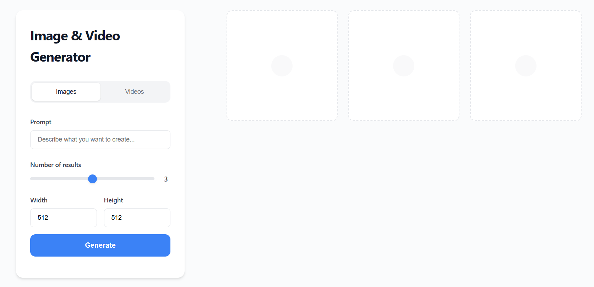

# Runware Image & Video Generator

A simple web application that allows you generate **AI-powered images and videos** using the [Runware SDK](https://www.npmjs.com/package/@runware/sdk-js).  
The project includes a Node.js/Express backend for handling Runware API requests and a frontend UI for user interaction.

<p align="center">
  
</p>

---

## 🚀 Features
- Generate **images** with customizable width, height, and number of results.  
- Generate **short videos** upto 4-8 secs duration with different resolutions.  
---

## 📂 Project Structure
```

├── server.js        # Express backend server
├── public/
│   ├── index.html   # Frontend UI
│   ├── style.css    # Styles for your frontend
└── .env             # Environment variables
```

---

## ⚙️ Setup & Installation

### 1. Clone the repository
```bash
git clone https://github.com/your-username/runware.git
cd runware
```

### 2. Install dependencies
```bash
npm install express dotenv @runware/sdk-js
```

### 3. Create a `.env` file
Add your Runware API key inside `.env`:
```env
RUNWARE_API_KEY=your_api_key_here
```

### 4. Run the server
```bash
node server.js
#OR
npm run start
```
Server will start at:
```
http://localhost:3000
```

---

## 🖥️ Usage
1. Open `http://localhost:3000` in your browser.  
2. Enter a **prompt** describing what you want to generate.  
3. Choose **Images** or **Videos**:  
   - **Images**: Set number of results, width, and height.  
   - **Videos**: Choose resolution.  
4. Click **Generate** and wait for results.  

---

## 🎊 Results


<p align="center">
   <b>Image Prompt: Cat with a hat</b><br><br>
   
</p>

---

Curious to see the app in action? 🤔 Watch a demo [here](https://youtu.be/yJAdysZPCC8) or try it yourself [here](https://runware-3csj.onrender.com). <br>
For more information, refer to the [Runware documentation](https://runware.ai/docs/en/getting-started/introduction).

---

## 📦 Dependencies
- [Express](https://expressjs.com/) – Backend server.  
- [dotenv](https://www.npmjs.com/package/dotenv) – Environment variable management.  
- [Runware SDK](https://www.npmjs.com/package/@runware/sdk-js) – AI image & video generation.  

---

## 📝 License
MIT License. Feel free to use and modify.  
